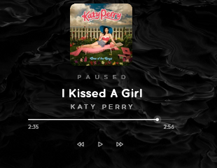
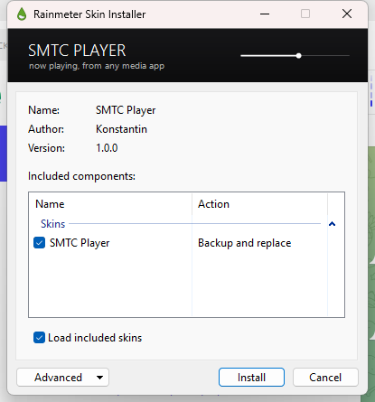

# SMTC Player

[](https://github.com/konstantinstrejko-oss/smtc-player/releases/latest/download/SMTC-Player.rmskin)
[](https://github.com/konstantinstrejko-oss/smtc-player/releases/latest)
[](LICENSE)

*[Русская версия](README.ru.md)*

A minimal now-playing widget for [Rainmeter](https://www.rainmeter.net/) that
reads **Windows SMTC** (Global System Media Transport Controls) — the same
system channel that draws the volume overlay with album art.

That means it works with players Rainmeter's bundled `NowPlaying` plugin does
not support: **Yandex Music**, Spotify, browsers, VLC — anything that reports to
the Windows media overlay.



## Install

1. **[Download SMTC-Player.rmskin](https://github.com/konstantinstrejko-oss/smtc-player/releases/latest/download/SMTC-Player.rmskin)**
2. Double-click the file — Rainmeter's own installer opens.
3. Press **Install**. The skin loads itself, nothing else to set up.



Requires Rainmeter 4.5+ and Windows 10 1809 or newer (that is when the SMTC API
appeared). To move the widget, drag it; to resize it, scroll on it.

### Don't have Rainmeter yet?

Rainmeter is free and open source, and this widget cannot run without it:

- official site: **https://www.rainmeter.net/**
- source and releases: **https://github.com/rainmeter/rainmeter/releases/latest**

The default installer is all you need.

> **Windows may warn about the bundled `.exe`.** It is the background bridge —
> unsigned, because code-signing certificates cost money. The full C# source is
> in this repo (`@Resources/Bridge/src`) and builds with one command, so you can
> compile it yourself and replace the binary if you prefer.

## Features

- Title, artist and album art from any SMTC-aware player
- Progress bar that actually moves (see [notes](docs/notes-ru.md) — most players
  report position as a snapshot, not a stream)
- Previous / play-pause / next, and click-to-seek on the progress line
- No cover art? The card collapses instead of leaving a hole
- Scroll wheel to resize
- Picks the session that is really playing, not the one that merely holds the
  media keys

## Shard Player — the same thing in the tray

[](https://github.com/konstantinstrejko-oss/smtc-player/releases/latest/download/Shard-Player.zip)

A desktop widget is useless exactly when music is playing: the desktop is covered
by a browser or a game. Since 1.1 the same process also runs a **tray icon** and a
mini player window. Rainmeter is not required — the archive above contains a
single `ShardPlayer.exe`.

The icon is the indicator: its ring fills as the track plays, the glyph shows
play or pause, and the tooltip carries artist and title.

| Action | Result |
|--------|--------|
| Left click | open the player window |
| Middle click | play / pause |
| **Wheel over the icon** | volume of the source app, not the system volume |
| Right click | menu: window layout, source, history, autostart |

The window is real glass: whatever sits underneath is blurred and warped by a
pixel shader, and the tint comes from the current album art. Two layouts,
horizontal and vertical. The window closes itself when it loses focus.

The backdrop is captured once when the window opens and is not refreshed
afterwards: the blur Windows itself produces belongs to the system, and no shader
can be applied to those pixels — an application cannot reach them. In practice
this means that if a video is playing underneath, the glass shows the frame
captured at open time.

Default hotkeys: `Ctrl+Alt+Space` for play/pause, `Ctrl+Alt+←/→` for tracks,
`Ctrl+Alt+↑/↓` for volume. Configurable in `%APPDATA%\Shard Player\config.ini`.

> **Windows 11 hides new tray icons** behind the `^` chevron. Drag the icon out
> onto the taskbar, or enable it under *Settings → Personalization → Taskbar →
> Other system tray icons*, otherwise "always visible" does not hold.

What the tray mode will never have: queue, playlist, likes or shuffle for Yandex
Music. SMTC exposes a remote control only — transport, metadata and cover art.

## How it works

Rainmeter cannot talk to WinRT, so a tiny background helper does it:

```
smtc_bridge.exe                        Rainmeter
 ├─ reads Windows SMTC (WinRT)
 ├─ !SetVariable ──WM_COPYDATA──▶      Player.ini  (title, artist, position, …)
 └─ cmd.inc      ◀──!WriteKeyValue──   button clicks
```

The bridge is a ~260 KB C# executable (fonts, shader and noise texture are
embedded). The skin starts it on load and a mutex keeps a single copy. With the
tray disabled it exits about a minute after Rainmeter is gone; with the tray on
it keeps running, since it does not need Rainmeter at all.

The SMTC loop and the interface live in separate threads: the loop is unchanged,
while the tray and the window run on their own STA thread and talk to it through
a command queue.

On first run it copies itself to `%LOCALAPPDATA%\RainmeterSMTC` and runs from
there — a running executable inside the skin folder cannot be moved, and the
Rainmeter installer moves that folder to `@Backup` on every update. Album art
and logs land in the same folder.

## Uninstall

Right-click the skin → **Unload skin**, then delete `SMTC Player` from your
Rainmeter skins folder. The bridge exits by itself; leftovers live in
`%LOCALAPPDATA%\RainmeterSMTC` and can be deleted too.

## Configuration

`@Resources\Variables.inc`:

| Variable | Meaning |
|----------|---------|
| `TextColor`, `ButtonColor`, `ButtonHover`, `DimAlpha` | colors |
| `PreferApp` | pin the widget to one app, e.g. `ru.yandex.desktop.music`. Empty = follow the system session |

## Build from source

```powershell
powershell -ExecutionPolicy Bypass -File build.ps1
```

Builds the bridge and packs `dist\SMTC-Player.rmskin`. Needs only `csc.exe` from
.NET Framework 4 (ships with Windows) and `Windows.winmd` from the Windows SDK.
`build.ps1 -SkipBridge` repacks without recompiling. Pushing a `v*` tag builds
the package on CI and attaches it to the release.

`tools\deploy.ps1` copies the skin straight into your Rainmeter folder for
development.

## Credits

- Visual language follows **Mond** by [Connect-R](https://www.deviantart.com/connect-r);
  icons here are original, drawn by `tools\make_icons.ps1`.
- Fonts: [Quicksand](https://fonts.google.com/specimen/Quicksand) (SIL OFL),
  Aquatico by Andrew Herndon (free for personal and commercial use).

## License

MIT — see [LICENSE](LICENSE). Fonts keep their own licenses.
